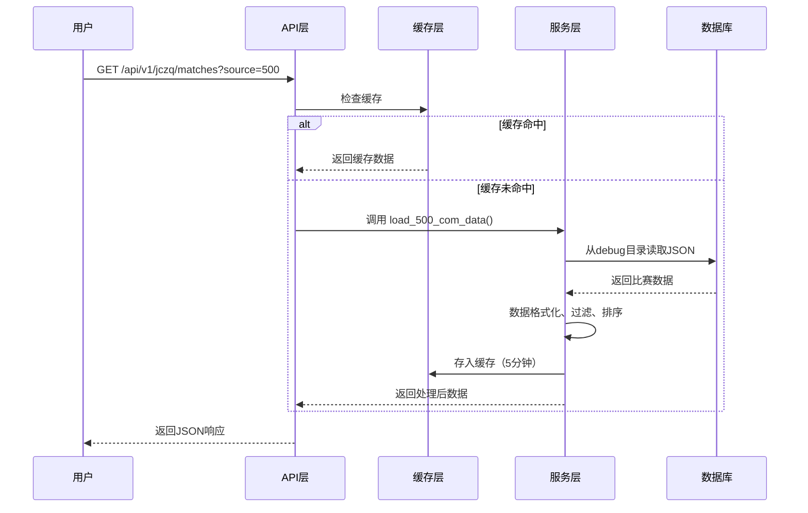
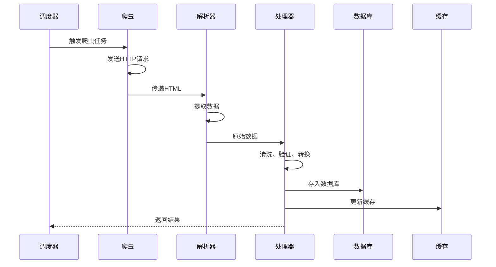
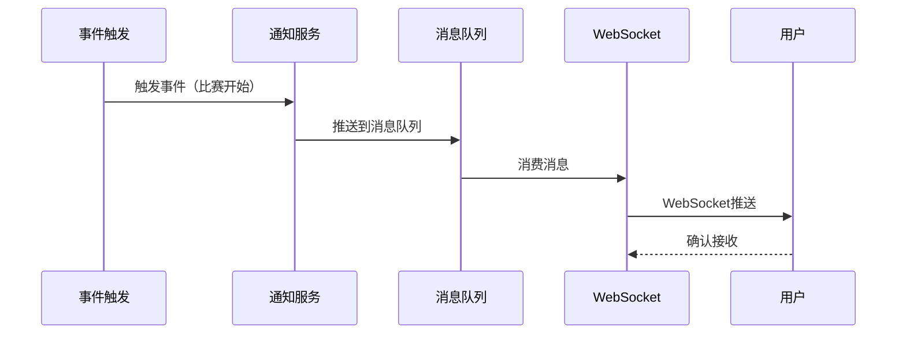

# 项目业务模块列举

> **项目名称**: Sport Lottery Sweeper (体育彩票扫描系统)  
> **更新时间**: 2026-01-19  
> **文档版本**: v1.0

## 📊 模块架构总览

```
sport-lottery-sweeper/
├── 核心业务层 (Core Business)
│   ├── 比赛管理 (Match Management)
│   ├── 情报系统 (Intelligence System)
│   ├── 赔率分析 (Odds Analysis)
│   ├── 预测系统 (Prediction System)
│   └── 用户系统 (User System)
│
├── 数据采集层 (Data Collection)
│   ├── 爬虫服务 (Scraper Services)
│   ├── 数据源集成 (Data Source Integration)
│   └── 调度任务 (Scheduled Tasks)
│
├── 数据处理层 (Data Processing)
│   ├── 数据清洗 (Data Cleaning)
│   ├── 数据验证 (Data Validation)
│   └── 数据转换 (Data Transformation)
│
├── 应用服务层 (Application Services)
│   ├── 认证授权 (Authentication & Authorization)
│   ├── 通知服务 (Notification Service)
│   └── 分析服务 (Analytics Service)
│
└── 接口层 (API Layer)
    ├── RESTful API (v1)
    ├── WebSocket API
    └── 管理后台 API (Admin API)
```

---

## 🏗️ 一、核心业务模块

### 1.1 比赛管理模块 (Match Management)

**位置**: `backend/models/match.py`, `backend/api/v1/matches.py`

#### 功能职责
- ⚽ 比赛数据存储和管理
- 📅 赛程安排和查询
- 🏆 联赛、球队、球员信息管理
- 🏟️ 场馆信息管理
- 📊 比赛统计数据

#### 核心数据表
| 表名 | 说明 | 核心字段 |
|------|------|----------|
| `matches` | 比赛主表 | match_id, home_team_id, away_team_id, match_date, status, score |
| `leagues` | 联赛表 | league_id, name, country, level, season |
| `teams` | 球队表 | team_id, name, league_id, coach, stadium_id |
| `players` | 球员表 | player_id, name, team_id, position, number |
| `venues` | 场馆表 | venue_id, name, city, capacity, surface_type |

#### API 端点
```http
GET    /api/v1/matches              # 获取比赛列表
GET    /api/v1/matches/{id}         # 获取比赛详情
POST   /api/v1/matches              # 创建比赛（管理员）
PUT    /api/v1/matches/{id}         # 更新比赛
DELETE /api/v1/matches/{id}         # 删除比赛

GET    /api/v1/jczq/matches         # 竞彩足球比赛（支持多数据源）
GET    /api/v1/jczq/leagues         # 联赛列表
POST   /api/v1/jczq/refresh         # 刷新缓存
```

#### 业务逻辑
- **多数据源支持**: 500彩票网、竞彩官网
- **智能过滤**: 日期范围、联赛、球队、状态
- **实时更新**: WebSocket 推送比分变化
- **缓存策略**: 5分钟缓存，支持手动刷新

---

### 1.2 情报系统模块 (Intelligence System)

**位置**: `backend/models/intelligence.py`, `backend/api/v1/intelligence.py`

#### 功能职责
- 📰 赛前情报采集和管理
- 🔍 情报分类和标签
- ⚖️ 情报权重计算
- 🔥 情报热度分析
- 🔗 情报关联关系

#### 核心数据表
| 表名 | 说明 | 核心字段 |
|------|------|----------|
| `intelligence` | 情报主表 | intel_id, match_id, type_id, content, weight, heat_score |
| `intelligence_types` | 情报类型 | type_id, name, category, priority |
| `intelligence_sources` | 情报来源 | source_id, name, credibility, type |
| `intelligence_relations` | 情报关联 | relation_id, intel_id, related_intel_id, relation_type |
| `intelligence_analytics` | 情报分析 | analytics_id, intel_id, sentiment, keywords, tags |

#### 情报分类体系
```yaml
injury:      伤病情况（权重: 9.5）
weather:     天气因素（权重: 7.5）
referee:     裁判信息（权重: 7.0）
motive:      战意分析（权重: 9.0）
tactics:     战术/教练（权重: 8.5）
atmosphere:  主场氛围（权重: 8.0）
history:     历史交锋（权重: 7.5）
other:       其他情报（权重: 7.0）
```

#### API 端点
```http
GET    /api/v1/intelligence                    # 获取情报列表
GET    /api/v1/intelligence/{id}               # 获取情报详情
POST   /api/v1/intelligence                    # 创建情报
PUT    /api/v1/intelligence/{id}               # 更新情报
DELETE /api/v1/intelligence/{id}               # 删除情报

GET    /api/v1/intelligence/match/{match_id}   # 获取比赛情报
GET    /api/v1/intelligence/types              # 获取情报类型
POST   /api/v1/intelligence/analyze            # 分析情报
```

#### 权重计算算法
```python
final_weight = (source_weight + category_weight) / 2

# 关键词微调
if contains('主力', '关键', '重要'):
    final_weight += 0.5
elif contains('可能', '或许', '传闻'):
    final_weight -= 0.5

# 权重范围: 7.0 ~ 9.8
```

---

### 1.3 赔率分析模块 (Odds Analysis)

**位置**: `backend/models/odds.py`

#### 功能职责
- 💰 赔率数据采集
- 📈 赔率变动追踪
- 📊 赔率比较分析
- 🎯 赔率异常检测
- 📉 历史赔率查询

#### 核心数据表
| 表名 | 说明 | 核心字段 |
|------|------|----------|
| `odds` | 赔率主表 | odds_id, match_id, bookmaker_id, home_win, draw, away_win |
| `odds_movements` | 赔率变动 | movement_id, odds_id, old_value, new_value, change_time |
| `bookmakers` | 博彩公司 | bookmaker_id, name, country, credibility |
| `odds_providers` | 赔率提供商 | provider_id, name, api_url, update_frequency |

#### 赔率类型
- **欧洲赔率** (European Odds): 1×2 三项赔率
- **亚洲盘** (Asian Handicap): 让球盘
- **大小球** (Over/Under): 总进球数
- **波胆** (Correct Score): 精确比分

#### 分析指标
- **凯利指数** (Kelly Index): 投资价值
- **赔率变化率**: 市场情绪
- **赔率离散度**: 市场分歧
- **返还率**: 博彩公司利润率

---

### 1.4 预测系统模块 (Prediction System)

**位置**: `backend/models/predictions.py`

#### 功能职责
- 🤖 AI 预测算法
- 📊 预测结果管理
- ✅ 预测准确率统计
- 🏅 预测方法评估
- 📈 预测趋势分析

#### 核心数据表
| 表名 | 说明 | 核心字段 |
|------|------|----------|
| `predictions` | 预测结果 | prediction_id, match_id, method_id, result, confidence |
| `prediction_methods` | 预测方法 | method_id, name, algorithm, accuracy_rate |
| `prediction_evaluations` | 预测评估 | eval_id, prediction_id, actual_result, is_correct |

#### 预测算法
1. **基于历史数据** (Historical Data)
   - 近期战绩分析
   - 主客场表现
   - 对战往绩

2. **基于赔率** (Odds-Based)
   - 欧赔概率转换
   - 凯利指数法
   - 赔率变动分析

3. **基于情报** (Intelligence-Based)
   - 情报权重加权
   - 关键因素识别
   - 综合评分系统

4. **机器学习** (Machine Learning)
   - 随机森林
   - 神经网络
   - XGBoost

---

### 1.5 用户系统模块 (User System)

**位置**: `backend/models/user.py`, `backend/services/auth_service.py`

#### 功能职责
- 👤 用户注册和登录
- 🔐 权限管理 (RBAC)
- 📝 用户活动日志
- 🎯 用户预测记录
- 💳 订阅和会员管理

#### 核心数据表
| 表名 | 说明 | 核心字段 |
|------|------|----------|
| `users` | 用户表 | user_id, username, email, password_hash, status |
| `roles` | 角色表 | role_id, name, description, permissions |
| `permissions` | 权限表 | permission_id, name, resource, action |
| `user_roles` | 用户角色关联 | user_id, role_id |
| `user_login_logs` | 登录日志 | log_id, user_id, ip_address, login_time |
| `user_activities` | 活动日志 | activity_id, user_id, action, timestamp |
| `user_subscriptions` | 订阅管理 | subscription_id, user_id, plan, expire_date |

#### 角色权限体系
```yaml
admin:
  - 系统管理
  - 用户管理
  - 数据审核
  - 爬虫管理

editor:
  - 情报编辑
  - 数据提交
  - 预测发布

vip_user:
  - 查看全部情报
  - 高级分析功能
  - 无广告

normal_user:
  - 基础查询
  - 公开情报查看
```

#### API 端点
```http
POST   /api/v1/auth/register        # 用户注册
POST   /api/v1/auth/login           # 用户登录
POST   /api/v1/auth/logout          # 用户登出
POST   /api/v1/auth/refresh         # 刷新令牌
GET    /api/v1/auth/me              # 获取当前用户信息

GET    /api/v1/admin/users          # 用户列表（管理员）
PUT    /api/v1/admin/users/{id}     # 修改用户
DELETE /api/v1/admin/users/{id}     # 删除用户
```

---

## 🕷️ 二、数据采集模块

### 2.1 爬虫服务 (Scraper Services)

**位置**: `backend/scrapers/`, `backend/services/crawler_service.py`

#### 爬虫列表
| 爬虫名称 | 数据源 | 采集内容 | 频率 |
|---------|--------|---------|------|
| `sporttery_scraper` | 竞彩官网 | 比赛赛程、赔率 | 每小时 |
| `500_com_scraper` | 500彩票网 | 比赛数据、情报 | 每30分钟 |
| `zqszsc_scraper` | 足球数据中心 | 历史数据、统计 | 每日 |
| `advanced_crawler` | 综合数据源 | 情报、赔率变动 | 实时 |

#### 爬虫架构
```
scrapers/
├── base.py                      # 爬虫基类
├── coordinator.py               # 爬虫协调器
├── scraper_coordinator.py       # 任务调度
├── sporttery_scraper.py         # 竞彩官网爬虫
├── zqszsc_scraper.py           # 足球数据中心爬虫
├── advanced_crawler.py          # 高级爬虫
└── sources/                     # 数据源适配器
    ├── __init__.py
    └── sporttery.py             # 竞彩官网适配器
```

#### 爬虫特性
- ✅ **反爬虫机制**: User-Agent 轮换、代理池、请求限速
- ✅ **错误重试**: 指数退避策略
- ✅ **数据验证**: 数据完整性检查
- ✅ **增量更新**: 只爬取新数据
- ✅ **断点续爬**: 支持中断恢复

#### 数据流程
```mermaid
数据源 → 爬虫采集 → 数据清洗 → 数据验证 → 入库 → 缓存 → API
```

---

### 2.2 数据源集成 (Data Source Integration)

**位置**: `backend/services/crawler_integration.py`

#### 支持的数据源
1. **竞彩官网** (Sporttery)
   - URL: `http://www.sporttery.cn`
   - 数据: 官方赛程、赔率
   - 更新: 实时

2. **500彩票网** (500.com)
   - URL: `https://live.500.com`
   - 数据: 比赛数据、情报
   - 更新: 每30分钟

3. **足球数据中心** (ZQSZSC)
   - URL: `http://www.zqszsc.com`
   - 数据: 历史数据、统计
   - 更新: 每日

4. **天气API**
   - 天气数据
   - 影响因素分析

#### 集成服务类
```python
class CrawlerIntegrationService:
    """爬虫集成服务"""
    
    async def fetch_matches(source: str) -> List[Match]
    async def fetch_intelligence(match_id: str) -> List[Intelligence]
    async def fetch_odds(match_id: str) -> List[Odds]
    async def sync_all_sources() -> Dict[str, Any]
```

---

### 2.3 调度任务 (Scheduled Tasks)

**位置**: `backend/tasks/`

#### 任务列表
| 任务名称 | 执行频率 | 说明 |
|---------|---------|------|
| `crawler_tasks` | 每小时 | 爬取最新比赛数据 |
| `match_tasks` | 每30分钟 | 更新比赛状态 |
| `intelligence_tasks` | 每15分钟 | 采集最新情报 |
| `analytics_tasks` | 每日凌晨 | 生成分析报告 |
| `notification_tasks` | 实时 | 发送通知消息 |

#### 任务调度框架
```python
# 使用 Celery 进行任务调度
from celery import Celery
from celery.schedules import crontab

app = Celery('sport_lottery')

@app.task
def crawl_matches():
    """爬取比赛任务"""
    pass

@app.task
def send_notifications():
    """发送通知任务"""
    pass

# 定时任务配置
app.conf.beat_schedule = {
    'crawl-every-hour': {
        'task': 'tasks.crawl_matches',
        'schedule': crontab(minute=0),
    },
}
```

---

## 🔧 三、数据处理模块

### 3.1 数据清洗 (Data Cleaning)

**位置**: `backend/processor.py`, `backend/processors/data_processor.py`

#### 清洗流程
```python
class DataProcessor:
    """数据处理器"""
    
    def process_intelligence(self, data: List[Dict]) -> List[Intelligence]:
        """处理情报数据"""
        # 1. 去重
        # 2. 格式化
        # 3. 分类
        # 4. 计算权重
        # 5. 验证
        pass
    
    def process_predictions(self, data: List[Dict]) -> List[Prediction]:
        """处理预测数据"""
        pass
```

#### 清洗规则
- **去重**: 基于内容哈希
- **格式化**: 统一日期时间格式
- **标准化**: 球队名称标准化
- **验证**: 数据完整性检查
- **分类**: 自动分类标签

---

### 3.2 数据验证 (Data Validation)

**位置**: `backend/models/data_review.py`

#### 验证规则表
| 表名 | 说明 |
|------|------|
| `data_reviews` | 数据审核记录 |
| `validation_rules` | 验证规则配置 |
| `validation_errors` | 验证错误日志 |

#### 验证类型
- **字段验证**: 必填项、类型、格式
- **业务验证**: 逻辑一致性
- **关联验证**: 外键完整性
- **范围验证**: 数值范围、枚举值

---

### 3.3 数据转换 (Data Transformation)

#### 转换场景
1. **API 响应格式转换**
   - 数据库模型 → JSON 响应
   - 字段映射和重命名
   - 嵌套数据处理

2. **数据源格式统一**
   - 不同数据源 → 统一格式
   - 字段对齐
   - 单位转换

3. **前端数据适配**
   - 后端数据 → 前端展示格式
   - 计算字段生成
   - 数据聚合

---

## 🚀 四、应用服务模块

### 4.1 认证授权服务 (Auth Service)

**位置**: `backend/services/auth_service.py`, `backend/core/auth.py`

#### 服务类
```python
# 1. 认证服务
class AuthenticationService:
    async def login(username, password) -> Token
    async def logout(token) -> bool
    async def register(user_data) -> User
    async def verify_token(token) -> User

# 2. 令牌服务
class TokenService:
    def create_access_token(user_id) -> str
    def create_refresh_token(user_id) -> str
    def verify_token(token) -> Dict

# 3. 权限服务
class PermissionService:
    async def check_permission(user, resource, action) -> bool
    async def get_user_permissions(user_id) -> List[Permission]

# 4. 用户管理服务
class UserManagementService:
    async def create_user(user_data) -> User
    async def update_user(user_id, data) -> User
    async def delete_user(user_id) -> bool
```

#### 认证方式
- **JWT Token**: 访问令牌和刷新令牌
- **OAuth2**: 第三方登录（预留）
- **API Key**: 服务端调用

---

### 4.2 通知服务 (Notification Service)

**位置**: `backend/services/notification_service.py`, `backend/tasks/notification_tasks.py`

#### 通知类型
| 类型 | 触发条件 | 通道 |
|------|---------|------|
| 比赛开始提醒 | 比赛前30分钟 | WebSocket, Email |
| 赔率异常波动 | 赔率变动>10% | WebSocket, 短信 |
| 重要情报发布 | 权重>9.0 | WebSocket, Push |
| 预测结果通知 | 比赛结束后 | Email |
| 系统公告 | 管理员发布 | 全站通知 |

#### 服务接口
```python
class NotificationService:
    async def send_notification(user_id, message, type) -> bool
    async def send_batch_notifications(users, message) -> int
    async def get_user_notifications(user_id, unread_only) -> List
    async def mark_as_read(notification_id) -> bool
```

---

### 4.3 分析服务 (Analytics Service)

**位置**: `backend/services/analytics_service.py`, `backend/tasks/analytics_tasks.py`

#### 分析功能
1. **比赛统计分析**
   - 胜平负分布
   - 进球数统计
   - 主客场表现

2. **情报质量分析**
   - 情报来源可信度
   - 预测准确率
   - 热门话题分析

3. **用户行为分析**
   - 活跃用户统计
   - 预测参与度
   - 功能使用分析

4. **性能监控**
   - API 响应时间
   - 爬虫成功率
   - 数据库性能

#### 分析报表
- 日报: 每日数据汇总
- 周报: 周度趋势分析
- 月报: 月度运营报告
- 实时: Dashboard 实时数据

---

## 🌐 五、接口层模块

### 5.1 RESTful API (v1)

**位置**: `backend/api/v1/`

#### API 模块列表
| 模块 | 文件 | 说明 |
|------|------|------|
| 竞彩足球 | `jczq.py` | 竞彩足球比赛API（支持多数据源） |
| 比赛管理 | `matches.py` | 比赛CRUD操作 |
| 公开比赛 | `public_matches.py` | 公开查询接口 |
| 情报管理 | `intelligence.py` | 情报CRUD和分析 |
| 用户认证 | `auth.py` | 登录注册、令牌管理 |
| 管理后台 | `admin.py` | 管理员功能 |
| 数据提交 | `data_submission.py` | 用户数据提交 |

#### API 设计规范
- **RESTful 风格**: 使用标准 HTTP 方法
- **统一响应格式**: `{success, data, message, timestamp}`
- **版本管理**: `/api/v1/...`
- **分页支持**: `page`, `size`, `total`
- **过滤排序**: 通过 Query 参数

---

### 5.2 WebSocket API

**位置**: `backend/api/websocket.py`

#### WebSocket 功能
```python
class ConnectionManager:
    """WebSocket 连接管理器"""
    
    async def connect(websocket: WebSocket)
    async def disconnect(websocket: WebSocket)
    async def broadcast(message: str)
    async def send_personal_message(message: str, websocket: WebSocket)
```

#### 实时推送事件
- `match_update`: 比赛状态更新
- `odds_change`: 赔率变动
- `new_intelligence`: 新情报发布
- `prediction_result`: 预测结果
- `system_notification`: 系统通知

---

### 5.3 管理后台 API

**位置**: `backend/admin/`, `backend/api/v1/admin.py`

#### 管理功能
1. **用户管理**
   - 用户列表
   - 角色分配
   - 权限管理

2. **数据管理**
   - 比赛管理
   - 情报审核
   - 数据修正

3. **系统管理**
   - 爬虫监控
   - 任务调度
   - 系统配置
   - 日志查看

4. **统计分析**
   - 运营数据
   - 用户分析
   - 性能监控

---

## 📦 六、支撑模块

### 6.1 核心工具 (Core Utilities)

**位置**: `backend/core/`

| 模块 | 文件 | 说明 |
|------|------|------|
| 数据库管理 | `database.py` | 数据库连接池、会话管理 |
| 缓存管理 | `cache_manager.py` | Redis 缓存管理 |
| 安全工具 | `security.py` | 密码加密、令牌生成 |
| 配置管理 | `config.py` | 配置加载和管理 |
| 中间件 | `middleware.py` | 请求拦截和处理 |
| 依赖注入 | `deps.py` | FastAPI 依赖项 |
| 异步初始化 | `async_initializer.py` | 异步组件初始化 |
| 模块加载器 | `module_loader.py` | 动态模块加载 |

---

### 6.2 CRUD 操作 (CRUD Operations)

**位置**: `backend/crud/`

```python
# crud/match.py
class MatchCRUD:
    async def create(db, match_data) -> Match
    async def get(db, match_id) -> Match
    async def get_multi(db, skip, limit) -> List[Match]
    async def update(db, match_id, data) -> Match
    async def delete(db, match_id) -> bool

# crud/user.py
class UserCRUD:
    async def create_user(db, user_data) -> User
    async def get_by_email(db, email) -> User
    async def authenticate(db, username, password) -> User
```

---

### 6.3 数据模型 (Data Models)

**位置**: `backend/models/`

#### 模型层次结构
```
models/
├── __init__.py              # 模型导出
├── base.py                  # 基础模型类
├── match.py                 # 比赛相关模型（9张表）
├── intelligence.py          # 情报相关模型（5张表）
├── user.py                  # 用户相关模型（6张表）
├── odds.py                  # 赔率相关模型（4张表）
├── predictions.py           # 预测相关模型（2张表）
├── data_review.py           # 数据审核模型（3张表）
└── venues.py                # 场馆模型（1张表）
```

---

### 6.4 数据模式 (Schemas)

**位置**: `backend/schemas/`

#### Pydantic 模型
```python
# schemas/response.py
class UnifiedResponse(BaseModel):
    success: bool
    data: Any
    message: str
    timestamp: str

class PageResponse(BaseModel):
    data: List[Any]
    total: int
    page: int
    size: int
```

---

## 📊 七、业务流程示例

### 7.1 用户查询比赛流程



---

### 7.2 爬虫数据采集流程



---

### 7.3 实时通知推送流程



---

## 🎯 八、模块依赖关系

### 8.1 依赖层次

```
┌─────────────────────────────────────┐
│         API Layer (接口层)           │
│  RESTful API │ WebSocket │ Admin    │
└────────────┬────────────────────────┘
             │
┌────────────▼────────────────────────┐
│     Service Layer (服务层)           │
│  Auth │ Match │ Intel │ Analytics   │
└────────────┬────────────────────────┘
             │
┌────────────▼────────────────────────┐
│   Business Logic (业务逻辑层)        │
│  Processor │ Validator │ Calculator │
└────────────┬────────────────────────┘
             │
┌────────────▼────────────────────────┐
│    Data Access (数据访问层)          │
│  Models │ CRUD │ Database │ Cache   │
└────────────┬────────────────────────┘
             │
┌────────────▼────────────────────────┐
│   Infrastructure (基础设施层)        │
│  PostgreSQL │ Redis │ Celery        │
└─────────────────────────────────────┘
```

---

### 8.2 模块间调用关系

```
前端 (Frontend)
  ↓
API 路由 (Routes)
  ↓
服务层 (Services)
  ↓
CRUD 操作 (CRUD)
  ↓
数据模型 (Models)
  ↓
数据库 (Database)
```

---

## 📈 九、模块统计数据

### 9.1 代码量统计

| 模块类型 | 文件数 | 代码行数（估算） |
|---------|-------|----------------|
| 数据模型 | 9 | ~3,000 |
| API 路由 | 8 | ~2,000 |
| 业务服务 | 8 | ~3,500 |
| 爬虫模块 | 10 | ~2,500 |
| 任务调度 | 9 | ~2,000 |
| 核心工具 | 11 | ~1,500 |
| CRUD 操作 | 3 | ~500 |
| **总计** | **58** | **~15,000** |

---

### 9.2 数据库表统计

| 类别 | 表数量 | 占比 |
|------|--------|------|
| 比赛相关 | 9 | 33% |
| 情报相关 | 5 | 19% |
| 用户相关 | 6 | 22% |
| 赔率相关 | 4 | 15% |
| 其他 | 3 | 11% |
| **总计** | **27** | **100%** |

---

### 9.3 API 端点统计

| 模块 | GET | POST | PUT | DELETE | 总计 |
|------|-----|------|-----|--------|------|
| 竞彩足球 | 3 | 1 | 0 | 0 | 4 |
| 比赛管理 | 2 | 1 | 1 | 1 | 5 |
| 情报管理 | 4 | 2 | 1 | 1 | 8 |
| 用户认证 | 2 | 3 | 0 | 0 | 5 |
| 管理后台 | 5 | 2 | 3 | 2 | 12 |
| **总计** | **16** | **9** | **5** | **4** | **34** |

---

## 🚀 十、模块扩展规划

### 10.1 短期规划（1-3个月）

- [ ] **赔率分析增强**
  - 实时赔率抓取
  - 赔率异常检测
  - 凯利指数计算

- [ ] **预测算法优化**
  - 集成机器学习模型
  - 提高预测准确率
  - A/B 测试框架

- [ ] **移动端支持**
  - 响应式设计
  - PWA 支持
  - 原生 App API

---

### 10.2 中期规划（3-6个月）

- [ ] **大数据分析**
  - 数据仓库建设
  - BI 报表系统
  - 可视化Dashboard

- [ ] **社交功能**
  - 用户互动
  - 评论系统
  - 专家认证

- [ ] **个性化推荐**
  - 推荐算法
  - 用户画像
  - 智能提醒

---

### 10.3 长期规划（6-12个月）

- [ ] **多语言支持**
  - 国际化
  - 多币种
  - 多时区

- [ ] **AI 助手**
  - 智能客服
  - 语音交互
  - 自动分析

- [ ] **区块链集成**
  - 数据可信
  - 透明化
  - 去中心化

---

## 📚 十一、相关文档索引

| 文档名称 | 路径 | 说明 |
|---------|------|------|
| 数据库架构评估 | `docs/DATABASE_ARCHITECTURE_EVALUATION.md` | 数据库设计评估 |
| 数据库使用指南 | `docs/DATABASE_USAGE_GUIDE.md` | 数据库操作手册 |
| API 优化总结 | `docs/API_OPTIMIZATION_SUMMARY.md` | API 优化报告 |
| 快速开始指南 | `QUICK_START.md` | 项目启动指南 |
| API 文档 | `API_DOCUMENTATION.md` | API 接口文档 |

---

## 🎓 十二、技术栈总结

### 后端技术栈
- **框架**: FastAPI, SQLAlchemy, Pydantic
- **数据库**: PostgreSQL (主)、SQLite (开发)
- **缓存**: Redis
- **任务队列**: Celery
- **爬虫**: BeautifulSoup4, requests, httpx
- **认证**: JWT, OAuth2

### 前端技术栈（参考）
- **框架**: Vue 3, Vite
- **UI库**: Element Plus
- **状态管理**: Pinia
- **请求**: Axios
- **WebSocket**: Socket.io-client

### 基础设施
- **容器化**: Docker, Docker Compose
- **数据库迁移**: Alembic
- **日志**: Python logging
- **监控**: Prometheus, Grafana（规划中）

---

## ✅ 总结

本项目共包含 **12个主要业务模块**、**58个代码文件**、**27张数据库表**、**34个API端点**，形成了完整的体育彩票数据采集、分析、预测系统。

### 核心优势
✅ **模块化设计**: 高内聚低耦合  
✅ **分层架构**: 清晰的职责划分  
✅ **可扩展性**: 易于添加新功能  
✅ **数据驱动**: 完善的数据采集和处理  
✅ **实时性**: WebSocket 实时推送  

---

**文档维护**: 随着项目演进持续更新  
**最后更新**: 2026-01-19
