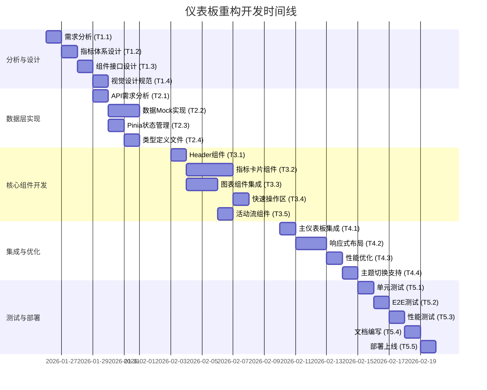

# 体育彩票数据平台 - 仪表板重构开发计划文档

## 文档信息

| 项目 | 体育彩票数据平台仪表板重构 |
|------|---------------------------|
| 版本 | v1.0 |
| 创建日期 | 2026年1月25日 |
| 负责人 | 开发团队 |
| 状态 | 规划阶段 |

## 1. 项目概述

### 1.1 项目背景
当前体育彩票数据管理平台已具备完整的功能模块，但首页仪表板信息呈现较为基础，缺乏数据驱动的决策支持能力。为提升管理员工作效率和系统监控能力，需要对仪表板进行全面的重构和优化。

### 1.2 项目目标
构建一个分层信息架构的智能仪表板，实现：
- **数据可视化**：关键指标图表化展示
- **操作便捷**：高频功能一键直达
- **状态透明**：系统健康状况一目了然
- **智能预警**：异常状态主动告警

## 2. 技术栈分析

### 2.1 现有技术栈
根据`package.json`分析：
- **前端框架**：Vue 3.3.4 + TypeScript
- **构建工具**：Vite 4.4.9
- **UI组件库**：Element Plus 2.4.1
- **图表库**：ECharts 5.4.3（已集成）
- **状态管理**：Pinia 2.1.6
- **HTTP客户端**：axios 1.5.0
- **路由管理**：Vue Router 4.2.4
- **工具库**：dayjs、lodash-es、mitt

### 2.2 技术选择理由
1. **ECharts**：项目已集成，功能强大，支持丰富图表类型
2. **Element Plus**：现有UI一致性，开发效率高
3. **Pinia**：现代化状态管理，TypeScript支持良好
4. **Vite**：快速构建，开发体验优秀

## 3. 详细设计方案

### 3.1 信息架构设计（方案一）
```
┌─────────────────────────────────────────────────────────────┐
│                    全局概览区（顶部）                         │
│  [系统状态指示灯] [当前时间] [用户欢迎语] [快速通知]          │
├─────────────────────────────────────────────────────────────┤
│                    核心指标区（第一屏）                       │
│  ┌─────┐ ┌─────┐ ┌─────┐ ┌─────┐ ┌─────┐ ┌─────┐           │
│  │ 比赛│ │ 情报│ │ 爬虫│ │ 预测│ │ 用户│ │ 系统│           │
│  │ 数据│ │ 数据│ │ 状态│ │ 准确│ │ 活跃│ │ 性能│           │
│  └─────┘ └─────┘ └─────┘ └─────┘ └─────┘ └─────┘           │
├─────────────────────────────────────────────────────────────┤
│                    可视化图表区（第二屏）                     │
│  ┌─────────────────┐ ┌─────────────────┐                   │
│  │  比赛数据趋势图  │ │  预测准确率趋势图 │                   │
│  └─────────────────┘ └─────────────────┘                   │
│  ┌─────────────────┐ ┌─────────────────┐                   │
│  │  爬虫成功率统计  │ │  用户活跃度分析  │                   │
│  └─────────────────┘ └─────────────────┘                   │
├─────────────────────────────────────────────────────────────┤
│                    快速操作区（第三屏）                       │
│  ┌─────┐ ┌─────┐ ┌─────┐ ┌─────┐ ┌─────┐                   │
│  │新增比│ │启动爬│ │查看情│ │模型训│ │系统配│               │
│  │赛数据│ │虫任务│ │报分析│ │练监控│ │置管理│               │
│  └─────┘ └─────┘ └─────┘ └─────┘ └─────┘                   │
├─────────────────────────────────────────────────────────────┤
│                    实时活动流（右侧边栏）                     │
│  ▼ 系统日志（最近10条）                                      │
│  ▼ 用户操作（最近5条）                                       │
│  ▼ 异常告警（如有）                                          │
└─────────────────────────────────────────────────────────────┘
```

### 3.2 组件结构设计
```
src/views/admin/Dashboard.vue
├── DashboardHeader.vue      # 顶部全局概览
│   ├── SystemStatusIndicator.vue
│   ├── UserWelcome.vue
│   └── QuickNotifications.vue
├── StatsOverview.vue        # 核心指标卡片（6个）
│   ├── MatchStatsCard.vue
│   ├── IntelligenceStatsCard.vue
│   ├── CrawlerStatsCard.vue
│   ├── PredictionStatsCard.vue
│   ├── UserStatsCard.vue
│   └── SystemStatsCard.vue
├── ChartsSection.vue        # 可视化图表
│   ├── MatchTrendChart.vue
│   ├── PredictionAccuracyChart.vue
│   ├── CrawlerSuccessRateChart.vue
│   └── UserActivityChart.vue
├── QuickActions.vue         # 快速操作区（5个按钮）
├── ActivityStream.vue       # 实时活动流
│   ├── SystemLogsStream.vue
│   ├── UserActionsStream.vue
│   └── AlertStream.vue
└── SystemAlerts.vue         # 系统告警
```

## 4. 详细任务分解

### 阶段一：分析与设计（2-3天）

| 任务编号 | 任务名称 | 描述 | 预计工时 | 前置任务 |
|----------|----------|------|----------|----------|
| T1.1 | 需求分析与用户画像 | 确定不同用户角色（管理员/分析师）的核心需求 | 4h | - |
| T1.2 | 数据指标体系设计 | 定义6-8个关键业务指标（KPI）及计算逻辑 | 8h | T1.1 |
| T1.3 | 组件接口设计 | 设计组件props/emit接口和类型定义 | 6h | T1.2 |
| T1.4 | 视觉设计规范 | 制定颜色、间距、字体等设计规范 | 4h | T1.2 |

### 阶段二：数据层实现（3-4天）

| 任务编号 | 任务名称 | 描述 | 预计工时 | 前置任务 |
|----------|----------|------|----------|----------|
| T2.1 | 后端API需求分析 | 分析现有API，确定新增接口需求 | 4h | T1.2 |
| T2.2 | 数据Mock实现 | 开发mock数据用于前端开发和测试 | 8h | T2.1 |
| T2.3 | Pinia状态管理设计 | 创建仪表板专用的Pinia store | 6h | T1.3 |
| T2.4 | 类型定义文件创建 | 创建TypeScript类型定义文件 | 4h | T2.3 |

### 阶段三：核心组件开发（5-6天）

| 任务编号 | 任务名称 | 描述 | 预计工时 | 前置任务 |
|----------|----------|------|----------|----------|
| T3.1 | DashboardHeader组件 | 实现顶部全局概览区域 | 8h | T2.4 |
| T3.2 | 指标卡片组件 | 开发6个核心指标卡片组件 | 16h | T2.4 |
| T3.3 | 图表组件集成 | 使用ECharts实现4个趋势图表 | 12h | T2.4 |
| T3.4 | 快速操作区组件 | 实现5个快速操作按钮 | 6h | T2.4 |
| T3.5 | 活动流组件 | 实现实时活动日志展示 | 8h | T2.4 |

### 阶段四：集成与优化（4-5天）

| 任务编号 | 任务名称 | 描述 | 预计工时 | 前置任务 |
|----------|----------|------|----------|----------|
| T4.1 | 主仪表板集成 | 将各组件集成到Dashboard.vue | 6h | T3.1-T3.5 |
| T4.2 | 响应式布局适配 | 确保移动端和平板兼容性 | 8h | T4.1 |
| T4.3 | 性能优化 | 实现数据懒加载、图表防抖等 | 6h | T4.2 |
| T4.4 | 主题切换支持 | 支持深色/浅色主题 | 4h | T4.3 |

### 阶段五：测试与部署（3-4天）

| 任务编号 | 任务名称 | 描述 | 预计工时 | 前置任务 |
|----------|----------|------|----------|----------|
| T5.1 | 单元测试编写 | 为关键组件编写Vitest单元测试 | 8h | T4.4 |
| T5.2 | E2E测试 | 使用Playwright编写端到端测试 | 6h | T5.1 |
| T5.3 | 性能测试 | 测试加载时间和内存使用 | 4h | T5.2 |
| T5.4 | 文档编写 | 编写用户使用文档和API文档 | 4h | T5.3 |
| T5.5 | 部署上线 | 部署到测试环境，进行UAT测试 | 8h | T5.4 |

## 5. 时间线与里程碑



### 关键里程碑
1. **M1**（2026-01-27）：需求分析与设计完成
2. **M2**（2026-01-31）：数据层实现完成
3. **M3**（2026-02-07）：核心组件开发完成
4. **M4**（2026-02-13）：集成优化完成
5. **M5**（2026-02-18）：测试部署完成，正式上线

## 6. 资源需求

### 6.1 人力资源
| 角色 | 人数 | 职责 | 投入比例 |
|------|------|------|----------|
| 前端开发工程师 | 2 | 组件开发、集成、测试 | 100% |
| UI/UX设计师 | 1 | 视觉设计、交互优化 | 50% |
| 后端开发工程师 | 1 | API接口开发、数据支持 | 30% |
| 测试工程师 | 1 | 测试用例编写、质量保证 | 50% |

### 6.2 开发环境
| 环境 | 配置要求 | 用途 |
|------|----------|------|
| 开发环境 | Node.js 20.5+、npm 9.8+ | 本地开发 |
| 测试环境 | 模拟生产环境配置 | 功能测试 |
| UAT环境 | 与生产环境一致 | 用户验收测试 |

### 6.3 工具需求
| 工具类别 | 具体工具 | 用途 |
|----------|----------|------|
| 开发工具 | VS Code、Vue DevTools | 代码编写、调试 |
| 版本控制 | Git、GitHub/GitLab | 代码管理 |
| 项目管理 | Jira/Trello | 任务跟踪 |
| 文档协作 | Confluence/Notion | 文档管理 |

## 7. 风险管理

### 7.1 识别的主要风险
| 风险类别 | 风险描述 | 概率 | 影响 |
|----------|----------|------|------|
| 技术风险 | ECharts集成复杂，性能优化难度大 | 中 | 高 |
| 进度风险 | 组件依赖关系复杂，集成时间超出预期 | 中 | 中 |
| 数据风险 | 后端API数据格式变更，前端适配成本高 | 低 | 高 |
| 质量风险 | 响应式布局适配不充分，移动端体验差 | 中 | 中 |

### 7.2 风险缓解措施
1. **技术风险缓解**：
   - 提前进行ECharts技术验证，制作原型
   - 制定性能优化方案，如虚拟滚动、懒加载
   - 建立组件性能监控机制

2. **进度风险缓解**：
   - 采用模块化开发，降低组件耦合度
   - 每周进行进度review，及时调整计划
   - 设置缓冲时间（总工时的15%）

3. **数据风险缓解**：
   - 与后端团队明确API接口规范
   - 使用TypeScript严格类型检查
   - 建立数据Mock机制，不依赖后端接口

4. **质量风险缓解**：
   - 制定移动端适配规范
   - 使用真实设备进行测试
   - 建立自动化响应式测试

## 8. 质量保证

### 8.1 质量标准
| 质量维度 | 标准要求 | 检查方法 |
|----------|----------|----------|
| 代码质量 | ESLint规范通过率100% | 自动化检查 |
| 测试覆盖 | 关键组件单元测试覆盖率≥80% | Vitest报告 |
| 性能指标 | 首屏加载时间≤2s，FCP≤1s | Lighthouse |
| 兼容性 | Chrome/Firefox/Safari/Edge主流版本 | 多浏览器测试 |

### 8.2 测试策略
1. **单元测试**：使用Vitest测试组件逻辑
2. **组件测试**：使用@vue/test-utils测试组件交互
3. **集成测试**：测试组件间数据流和交互
4. **E2E测试**：使用Playwright模拟用户操作
5. **性能测试**：使用Lighthouse进行性能分析

## 9. 交付物

### 9.1 代码交付物
1. **组件库**：6个指标卡片组件 + 4个图表组件 + 其他功能组件
2. **状态管理**：Pinia store模块及类型定义
3. **API接口**：数据Mock实现和接口调用封装
4. **样式文件**：CSS变量定义和组件样式

### 9.2 文档交付物
1. **技术设计文档**：组件接口、数据流设计
2. **API文档**：数据接口规范和使用说明
3. **用户手册**：仪表板功能使用指南
4. **部署文档**：环境配置和发布流程

### 9.3 测试交付物
1. **测试用例**：单元测试和E2E测试用例
2. **测试报告**：功能测试和性能测试报告
3. **质量报告**：代码质量检查报告

## 10. 成功标准

### 10.1 业务成功标准
1. ✅ 管理员系统监控时间减少30%
2. ✅ 关键业务指标可视化覆盖率100%
3. ✅ 系统异常发现时间从小时级降到分钟级
4. ✅ 用户满意度调查评分≥4.5/5.0

### 10.2 技术成功标准
1. ✅ 仪表板加载性能评分≥90（Lighthouse）
2. ✅ 组件单元测试覆盖率≥80%
3. ✅ 代码质量检查零严重问题
4. ✅ 移动端响应式适配通过率100%

## 11. 附录

### 11.1 关键指标定义
```typescript
// 建议的6个核心指标
interface CoreMetrics {
  // 1. 比赛数据指标
  matchMetrics: {
    totalMatches: number;      // 比赛总数
    newMatchesToday: number;   // 今日新增
    upcomingMatches: number;   // 即将开始
  };
  
  // 2. 情报数据指标
  intelligenceMetrics: {
    totalRecords: number;      // 情报记录总数
    newToday: number;          // 今日新增
    accuracyRate: string;      // 准确率
  };
  
  // 3. 爬虫状态指标
  crawlerMetrics: {
    totalConfigs: number;      // 爬虫配置总数
    activeTasks: number;       // 运行中任务
    successRate: string;       // 成功率
  };
  
  // 4. 预测准确率指标
  predictionMetrics: {
    totalPredictions: number;  // 预测总数
    accuracyRate: string;      // 预测准确率
    trend: 'up' | 'down';      // 趋势
  };
  
  // 5. 用户活跃度指标
  userMetrics: {
    totalUsers: number;        // 用户总数
    activeUsers: number;       // 活跃用户
    newUsersToday: number;     // 今日新增
  };
  
  // 6. 系统性能指标
  systemMetrics: {
    cpuUsage: string;          // CPU使用率
    memoryUsage: string;       // 内存使用率
    responseTime: string;      // API响应时间
  };
}
```

### 11.2 开发规范引用
1. 项目别名配置：`@/` → `./src`
2. 组件命名规范：PascalCase
3. 文件组织规范：按功能模块分目录
4. 代码提交规范：遵循Conventional Commits

---

## 下一步行动

### 立即行动（本周内）
1. ✅ 召开项目启动会议，明确各角色职责
2. ✅ 分配阶段一任务给相关人员
3. ✅ 搭建开发环境，确保所有依赖正常
4. ✅ 创建项目分支和开发工作流

### 短期跟进（2周内）
1. 🔄 完成需求分析和设计评审
2. 🔄 确定后端API接口规范
3. 🔄 开始核心组件开发
4. 🔄 建立持续集成流程

### 长期规划（1个月内）
1. ⏳ 完成所有组件开发和集成
2. ⏳ 进行全面的测试和优化
3. ⏳ 准备部署和上线工作
4. ⏳ 制定后续迭代计划

---

**审批确认**

| 角色 | 姓名 | 审批意见 | 签字 | 日期 |
|------|------|----------|------|------|
| 项目经理 | | | | |
| 技术负责人 | | | | |
| 产品负责人 | | | | |
| 质量负责人 | | | | |

---

**文档修订记录**

| 版本 | 修订日期 | 修订内容 | 修订人 |
|------|----------|----------|--------|
| v1.0 | 2026-01-25 | 初始版本创建 | 开发团队 |
| | | | |
