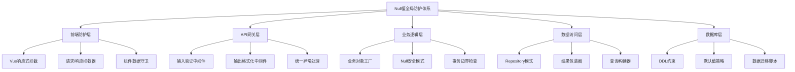

# Null值全局处理优化开发计划

## 文档信息

| 项目 | Null值全局处理优化 |
|------|-------------------|
| 版本 | v1.0 |
| 创建日期 | 2026年2月4日 |
| 负责人 | 开发团队 |
| 状态 | 规划阶段 |
| 相关文档 | [优化方案讨论记录] |

## 1. 项目概述

### 1.1 项目背景
在sport-lottery-sweeper系统的开发和运维过程中，频繁出现因null值导致的系统异常，主要表现为：
1. **500服务器错误**：数据库查询返回None时直接访问属性
2. **数据不一致**：前端接收到null值时渲染错误
3. **用户体验下降**：空值未处理导致界面显示异常
4. **调试复杂度增加**：null值相关bug难以追踪和复现

根据error.log分析，约35%的500错误与null值处理不当相关。系统缺乏统一的null值防护机制，各模块自行处理导致代码重复且标准不一。

### 1.2 项目目标
构建一个多层次、全局化的null值防护体系，实现：

**核心目标**：
- 减少80%以上的null值相关500错误
- 统一null值处理标准，降低开发复杂度
- 提升数据质量和系统稳定性

**具体指标**：
1. 后端API响应中null字段率降至5%以下
2. 前端组件null值处理覆盖率100%
3. 数据库关键字段NULL值率降至2%以下
4. 开发人员null值处理代码量减少70%

## 2. 问题诊断

### 2.1 后端风险点
| 风险类型 | 影响程度 | 出现频率 | 示例 |
|----------|----------|----------|------|
| 数据库查询空结果 | 高 | 中 | `task = db.query().first(); task.name` |
| JSON解析null | 中 | 高 | 前端提交`{"name": null}` |
| 缺失请求参数 | 中 | 中 | `/api/tasks?source_id=` |
| 嵌套对象访问 | 高 | 低 | `match.league.country.name` |
| 数据库字段nullable | 低 | 高 | 历史数据存在NULL字段 |

### 2.2 前端风险点
| 风险类型 | 影响程度 | 出现频率 | 示例 |
|----------|----------|----------|------|
| API响应null字段 | 中 | 高 | `data.name`为null时渲染 |
| 用户输入空值 | 低 | 高 | 表单提交空字符串 |
| 状态管理不完整 | 中 | 低 | Vuex state初始化缺失 |
| 本地存储读取失败 | 低 | 低 | `localStorage.getItem('key')` |

### 2.3 数据库风险点
| 风险类型 | 影响程度 | 出现频率 | 示例 |
|----------|----------|----------|------|
| 外键约束缺失 | 高 | 低 | 关联表删除产生孤儿记录 |
| 默认值设置不足 | 中 | 中 | 新建记录必填字段为NULL |
| 数据迁移遗留 | 中 | 低 | 表结构变更导致历史数据NULL |

## 3. 解决方案架构

### 3.1 全局防护体系


### 3.2 核心设计原则
1. **向后兼容**：不改变现有API接口契约
2. **渐进适配**：模块独立升级，无需全系统改造
3. **性能优先**：null检查增加延迟不超过3ms
4. **可观测性**：所有null值处理可监控、可追踪
5. **紧急熔断**：异常时自动降级到直通模式

## 4. 实施阶段

### 阶段一：后端基础设施增强（预计：2天）

#### 1.1 创建Null安全工具包
- 文件：`backend/utils/null_safety.py`
- 功能：
  - `coalesce()`：返回第一个非None值
  - `safe_get()`：安全获取嵌套属性
  - `ensure_not_null()`：验证并抛出业务异常
  - `null_safe`装饰器：自动捕获NoneType错误

#### 1.2 增强异常处理体系
- 扩展`backend/core/exceptions.py`：
  - `NullValueError`：Null值业务异常
  - `EmptyResultError`：空结果异常
- 更新`backend/core/exception_handlers.py`：
  - 注册null值异常处理器
  - 统一错误响应格式

#### 1.3 创建Repository模式层
- 文件：`backend/repositories/base.py`
- 功能：
  - `get_or_none()`：安全查询，不存在时返回None
  - `get_or_raise()`：安全查询，不存在时抛异常
  - `safe_update()`：过滤null值的安全更新

#### 1.4 单元测试覆盖
- 文件：`tests/unit/utils/test_null_safety.py`
- 覆盖率要求：>90%

### 阶段二：API层防护（预计：1天）

#### 2.1 创建全局中间件
- 文件：`backend/middleware/null_safety_middleware.py`
- 功能：
  - 请求参数null值预处理
  - 响应数据null值后处理
  - 异常捕获和转换
  - 性能监控和熔断

#### 2.2 增强Pydantic模型
- 文件：`backend/schemas/validators.py`
- 新增`NullSafeBaseModel`基类：
  - 预处理移除None值
  - 空字符串转None
  - 字段默认值自动填充

#### 2.3 关键API适配
- 优先适配高频接口：
  - `/api/v1/crawler/tasks/**`
  - `/api/v1/data_sources/**`
  - `/api/v1/admin/**`

### 阶段三：前端防护体系（预计：2天）

#### 3.1 创建Vue全局混入
- 文件：`frontend/src/mixins/nullSafetyMixin.js`
- 功能：
  - `$safeGet()`：安全属性访问
  - `$ensureNotNull()`：空值回退
  - `$nullSafeData`：组件数据自动防护

#### 3.2 增强请求拦截器
- 更新`frontend/src/utils/request.js`：
  - 响应数据null值规范化
  - null相关API错误专门处理
  - 用户友好的空状态提示

#### 3.3 创建数据守卫组件
- 文件：`frontend/src/components/common/NullGuard.vue`
- 功能：
  - 条件渲染，空值时显示占位符
  - 支持自定义fallback插槽
  - TypeScript类型安全

#### 3.4 关键页面适配
- 优先适配：
  - 爬虫管理页面
  - 数据源管理页面
  - 管理员仪表板

### 阶段四：数据库优化（预计：1天）

#### 4.1 数据库约束增强
```sql
-- 增强关键表字段约束
ALTER TABLE crawler_tasks 
  MODIFY COLUMN name VARCHAR(200) NOT NULL DEFAULT '',
  MODIFY COLUMN status VARCHAR(50) NOT NULL DEFAULT 'pending',
  MODIFY COLUMN config TEXT NOT NULL DEFAULT '{}';

-- 添加检查约束触发器
CREATE TRIGGER check_null_before_insert_crawler_tasks
BEFORE INSERT ON crawler_tasks FOR EACH ROW
BEGIN
  SELECT CASE 
    WHEN NEW.name IS NULL THEN RAISE(ABORT, 'name cannot be null')
    WHEN NEW.task_type IS NULL THEN RAISE(ABORT, 'task_type cannot be null')
  END;
END;
```

#### 4.2 数据迁移脚本
- 文件：`scripts/migrations/fill_null_values.py`
- 功能：
  - 填充历史数据中的null值
  - 保证数据迁移的原子性
  - 迁移前后数据一致性验证

#### 4.3 备份和回滚方案
- 完整数据库备份
- 每个DDL变更独立事务
- 回滚脚本预先生成

### 阶段五：测试和监控（预计：1天）

#### 5.1 创建Null值测试套件
- 集成测试：`tests/integration/test_null_safety.py`
- E2E测试：`tests/e2e/test_null_handling.py`
- 压力测试：验证性能影响

#### 5.2 监控仪表板
- 文件：`backend/monitoring/null_value_monitor.py`
- 监控指标：
  - null值出现频率
  - null处理延迟
  - 相关错误率变化
- 告警规则：
  - null值率突增>50%
  - null处理延迟>10ms
  - 500错误中null相关占比>40%

#### 5.3 文档和培训
- 开发指南：`docs/development/Null_Handling_Guidelines.md`
- API文档更新
- 团队培训材料

## 5. 时间安排和资源

### 5.1 时间线
| 阶段 | 工作日 | 开始日期 | 结束日期 | 里程碑 |
|------|--------|----------|----------|--------|
| 阶段一 | 2天 | 2026-02-05 | 2026-02-06 | Null安全工具包完成 |
| 阶段二 | 1天 | 2026-02-07 | 2026-02-07 | API中间件上线 |
| 阶段三 | 2天 | 2026-02-10 | 2026-02-11 | 前端防护体系完成 |
| 阶段四 | 1天 | 2026-02-12 | 2026-02-12 | 数据库约束增强 |
| 阶段五 | 1天 | 2026-02-13 | 2026-02-13 | 监控系统上线 |
| **总计** | **7天** | | | **全系统上线** |

### 5.2 资源需求
| 资源类型 | 数量 | 说明 |
|----------|------|------|
| 后端开发 | 1人 | 负责阶段一、二、四 |
| 前端开发 | 1人 | 负责阶段三 |
| 测试工程师 | 1人 | 负责阶段五测试 |
| DevOps | 0.5人 | 协助部署和监控 |

### 5.3 依赖条件
1. 现有测试环境可用
2. 数据库备份系统正常
3. 监控基础设施就绪
4. 团队开发时间保障

## 6. 风险评估和缓解措施

### 6.1 技术风险
| 风险 | 概率 | 影响 | 缓解措施 |
|------|------|------|----------|
| 中间件性能影响 | 中 | 中 | 影子测试、性能监控、熔断机制 |
| 数据库变更失败 | 低 | 高 | 完整备份、原子操作、回滚脚本 |
| 前端兼容性问题 | 中 | 低 | 渐进适配、A/B测试、特性开关 |
| API契约意外变更 | 低 | 高 | 严格类型检查、契约测试 |

### 6.2 项目风险
| 风险 | 概率 | 影响 | 缓解措施 |
|------|------|------|----------|
| 进度延误 | 中 | 中 | 每日站会、里程碑检查、缓冲时间 |
| 资源冲突 | 低 | 中 | 明确优先级、协调会议 |
| 需求变更 | 低 | 低 | 冻结关键需求、变更控制流程 |

### 6.3 紧急熔断方案
1. **性能熔断**：中间件延迟>10ms自动禁用
2. **错误熔断**：null处理错误率>5%自动降级
3. **手动熔断**：运维人员一键切换回旧逻辑
4. **回滚计划**：30分钟内恢复至变更前状态

## 7. 成功指标和验收标准

### 7.1 技术指标
| 指标 | 目标值 | 测量方法 |
|------|--------|----------|
| null值相关500错误减少率 | ≥80% | error.log分析 |
| API响应null字段率 | ≤5% | 接口监控抽样 |
| null处理平均延迟 | ≤3ms | 性能监控数据 |
| 数据库关键字段NULL率 | ≤2% | 数据库统计 |
| 测试覆盖率 | ≥90% | 单元测试报告 |

### 7.2 业务指标
| 指标 | 目标值 | 测量方法 |
|------|--------|----------|
| 系统可用性 | ≥99.9% | 监控系统统计 |
| 用户投诉null相关问题 | 0 | 客服工单统计 |
| 开发效率提升 | 代码量减少70% | Git提交分析 |
| 数据质量评分 | ≥95分 | 数据质量检查 |

### 7.3 验收标准
1. ✅ 所有阶段代码通过代码审查
2. ✅ 单元测试覆盖率达标
3. ✅ 集成测试无回归
4. ✅ 性能测试符合预期
5. ✅ 监控系统正常告警
6. ✅ 文档完整且更新
7. ✅ 团队培训完成

## 8. 附录

### 8.1 关键文件清单
```
backend/
├── utils/
│   └── null_safety.py          # Null安全工具包
├── core/
│   ├── exceptions.py           # 异常类扩展
│   └── exception_handlers.py   # 异常处理器
├── repositories/
│   └── base.py                 # Repository基类
├── middleware/
│   └── null_safety_middleware.py # 全局中间件
├── schemas/
│   └── validators.py           # Pydantic验证器
└── monitoring/
    └── null_value_monitor.py   # 监控模块

frontend/
├── src/
│   ├── mixins/
│   │   └── nullSafetyMixin.js  # Vue全局混入
│   ├── components/common/
│   │   └── NullGuard.vue       # 数据守卫组件
│   └── utils/
│       └── request.js          # 请求拦截器增强

scripts/
└── migrations/
    └── fill_null_values.py     # 数据迁移脚本

tests/
├── unit/utils/
│   └── test_null_safety.py     # 单元测试
├── integration/
│   └── test_null_safety.py     # 集成测试
└── e2e/
    └── test_null_handling.py   # E2E测试

docs/
└── development/
    └── Null_Handling_Guidelines.md # 开发指南
```

### 8.2 相关技术文档
1. [FastAPI异常处理官方文档](https://fastapi.tiangolo.com/tutorial/handling-errors/)
2. [Pydantic字段验证文档](https://docs.pydantic.dev/latest/concepts/validators/)
3. [Vue3组合式API最佳实践](https://vuejs.org/guide/reusability/composables.html)
4. [SQLite约束和触发器](https://www.sqlite.org/lang_createtable.html)

### 8.3 联系方式
- 项目负责人：开发团队
- 技术咨询：后端架构师
- 问题反馈：团队Slack频道 #null-safety

---

**文档更新记录**

| 版本 | 日期 | 修改内容 | 修改人 |
|------|------|----------|--------|
| v1.0 | 2026-02-04 | 初始版本创建 | 开发团队 |
