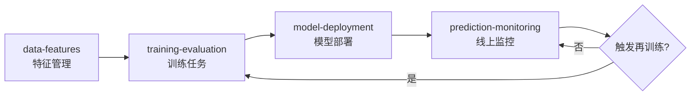
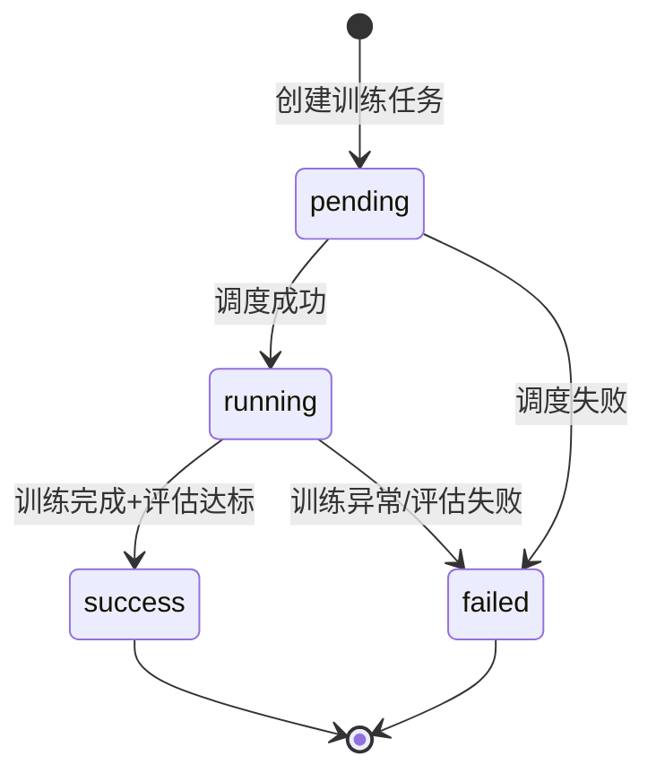
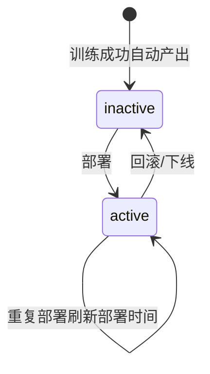
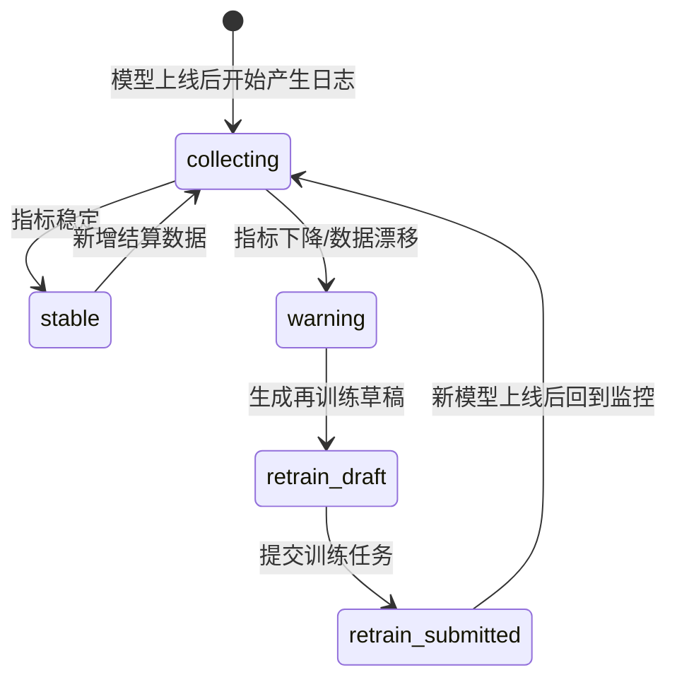

# 平局预测管理状态机图（闭环）

## 1. 使用说明
- 本文档定义四页面闭环中的状态流转标准。
- 前后端、接口、测试必须共享同一状态口径。

## 2. 全链路流程图

## 3. 训练任务状态机

### 状态说明
- `pending`：任务已创建，等待执行。
- `running`：任务执行中。
- `success`：训练和评估通过，可生成模型版本。
- `failed`：训练或评估失败。

## 4. 模型版本状态机

### 状态说明
- `inactive`：候选模型，未上线。
- `active`：线上生效模型。

## 5. 预测监控与再训练状态机

### 状态说明
- `collecting`：持续采集预测与赛果。
- `stable`：指标在阈值内。
- `warning`：触发告警阈值。
- `retrain_draft`：已生成再训练参数草稿，待确认。
- `retrain_submitted`：已创建新的训练任务。

## 6. 页面与状态动作映射

| 页面 | 可见状态 | 可执行动作 | 下游影响 |
|---|---|---|---|
| data-features | 特征启用态 | 启停、编辑 | 影响训练入参 |
| training-evaluation | pending/running/success/failed | 创建任务、看日志 | success后产出模型 |
| model-deployment | inactive/active | 部署、回滚 | 影响线上预测来源 |
| prediction-monitoring | collecting/stable/warning | 查询、生成再训练草稿 | 回流训练页 |

## 7. 模拟数据状态要求
- `data-features`：保留17条既有数据，不改状态。
- `training-evaluation`：至少1条 `success` 模拟任务。
- `model-deployment`：至少1条 `inactive` 或 `active` 模拟模型。
- `prediction-monitoring`：至少1条可计算统计的预测记录。

## 8. 一致性校验规则
1. `model.training_job_id` 必须存在。
2. `prediction_meta.model_version_id` 应可反查模型。
3. 页面展示状态文案必须从统一字典映射，不允许页面各自硬编码差异。

