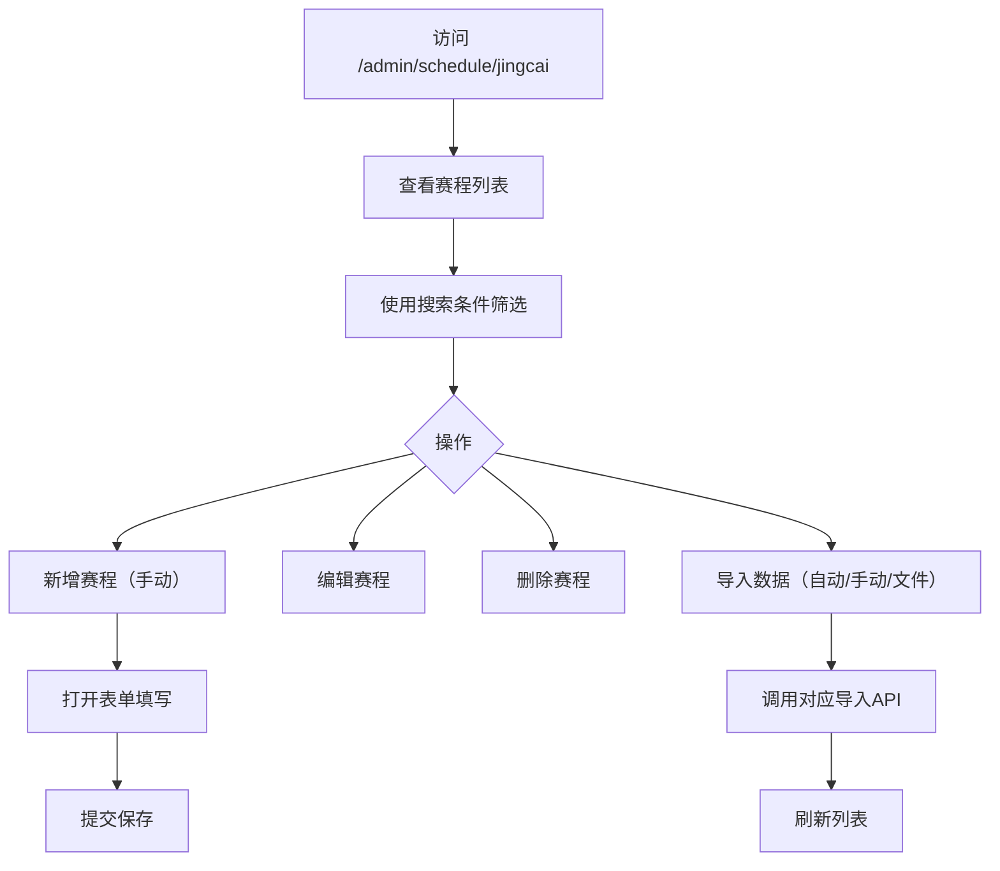

# 页面操作逻辑整理文档

## 📋 概述
本文档整理了三个核心页面的用户操作逻辑，旨在让AI（包括开发者）更清晰地理解任务流程、现有实现与待修改点，便于后续开发和维护。

## 📊 页面操作逻辑总览

| 页面 | URL路径 | 前端组件路径 | 主要功能 | 当前实现状态 |
|------|---------|-------------|----------|-------------|
| 数据源管理 | `/admin/crawler/data-source-management` | `frontend/src/views/admin/crawler/DataSourceManagement.vue` | 增删改查数据源（如500彩票网），支持健康检查 | 基础功能已实现，部分字段需调整 |
| 任务控制台 | `/admin/crawler/task-console` | `frontend/src/views/admin/crawler/TaskConsole.vue` | 创建、编辑、删除、执行爬虫任务，监控任务状态 | 任务管理功能基本完备，缺少"执行"按钮和分类下拉框 |
| 竞彩赛程 | `/admin/schedule/jingcai` | `frontend/src/views/admin/match/LotterySchedule.vue` | 展示竞彩赛程数据，支持手动/自动/文件导入，增删改查 | 展示与基础操作已实现 |

---

## 一、数据源管理页面 (DataSourceManagement.vue)

### 🧭 用户操作流程图
```mermaid
flowchart TD
    A[访问 /admin/crawler/data-source-management] --> B[查看数据源列表与统计卡片]
    B --> C{点击"新增数据源"}
    C --> D[打开新增数据源表单]
    D --> E[填写表单（源ID自动生成）]
    E --> F{点击"确定"}
    F --> G[提交到后端API]
    G --> H{提交结果}
    H -->|成功| I[显示成功提示，列表刷新]
    H -->|失败| J[显示错误提示，表单保留]
    B --> K[对列表项操作]
    K --> L[编辑]
    K --> M[删除]
    K --> N[测试连接]
```

### 📝 表单字段定义（当前 vs 需求）

| 字段 | 当前实现（需修改） | 用户需求 | 说明 |
|------|-------------------|----------|------|
| 源ID | 手动输入 (`formData.sourceId`) | **自动生成**，3位数字，从001开始递增 | 后端应生成唯一ID，前端不展示输入框或改为只读 |
| 名称 | 输入框，必填 | 示例："500彩票网竞彩足球" | 可添加placeholder提示 |
| URL | 输入框，必填 | 示例："https://trade.500.com/jczq/" | 需验证URL格式 |
| 内容分类 | 下拉选择（已包含"比赛数据"） | 保持"比赛数据"选项 | 当前选项已满足 |
| 请求方法 | 下拉选择（GET/POST等） | 保持现有 | - |
| 超时时间 | 数字输入框 | 保持现有 | - |
| 请求头/参数 | 文本域（JSON格式） | 保持现有 | - |
| 描述 | 文本域 | 保持现有 | - |

### ✅ 成功/错误处理
- **当前实现**：使用 `ElMessage.success()` / `ElMessage.error()` 显示提示。
- **需求符合**：已满足"正确提交和错误提交后要有文字提示"。

### 🔧 待修改点
1. **源ID自动生成**：移除表单中的"源ID"输入框，或将其设置为只读，由后端返回生成的ID（3位数字，如"001"）。
2. **默认样式/提示词**：在名称和URL字段添加placeholder，例如：
   - 名称：`请输入数据源名称，如"500彩票网竞彩足球"`
   - URL：`请输入数据源地址，如"https://trade.500.com/jczq/"`

---

## 二、任务控制台页面 (TaskConsole.vue)

### 🧭 用户操作流程图
```mermaid
flowchart TD
    A[访问 /admin/crawler/task-console] --> B[查看任务统计与列表]
    B --> C{点击"新建任务"}
    C --> D[打开新建任务表单]
    D --> E[填写表单（含分类下拉框）]
    E --> F{点击"确定"}
    F --> G[提交到后端API]
    G --> H{提交结果}
    H -->|成功| I[显示成功提示，列表刷新]
    H -->|失败| J[显示错误提示，表单保留]
    B --> K[对列表项操作]
    K --> L[编辑]
    K --> M[删除]
    K --> N[执行（立即开始）]
    N --> O[触发爬虫，数据保存到竞彩赛程表]
    O --> P[任务状态更新为"运行中"/"已完成"]
```

### 📝 表单字段定义（当前 vs 需求）

| 字段 | 当前实现（需修改） | 用户需求 | 说明 |
|------|-------------------|----------|------|
| 任务名称 | 输入框，必填 | 保持现有 | - |
| 任务类型 | 下拉选择（DATA_COLLECTION等） | **增加"分类"下拉框**，枚举：竞彩比赛赛程、北单比赛赛程、情报分类 | 当前"任务类型"可能用于技术分类，新增"分类"用于业务分类 |
| 源ID | 输入框，必填 | 保持现有（关联数据源） | - |
| 优先级 | 下拉选择（1-4） | 保持现有 | - |
| 配置参数 | 文本域（JSON） | 保持现有 | - |
| 计划执行时间 | 日期时间选择器 | 保持现有 | - |

### 🎯 关键需求细节
- **分类下拉选项**：添加新字段（如 `category`），选项值建议：
  - `jingcai_schedule`（竞彩比赛赛程）
  - `beidan_schedule`（北单比赛赛程）  
  - `intelligence`（情报分类）
- **执行按钮**：当前操作列只有"日志"、"编辑"、"删除"，需**添加"执行"按钮**，调用 `triggerTask(id)` API。
- **数据流向**：当分类选择"竞彩比赛赛程"并执行后，爬取的数据应保存到**竞彩赛程表**（对应后端 `lottery_schedules` 相关接口）。

### ✅ 现有功能
- 任务创建、编辑、删除（调用 `/api/admin/crawler/tasks`）
- 任务列表分页、筛选
- 任务统计卡片
- 实时日志查看（模拟）

### 🔧 待修改点
1. **表单新增"分类"字段**：在"任务类型"后增加下拉框，提供上述三个枚举选项。
2. **列表添加"执行"按钮**：在操作列中增加"执行"按钮，调用 `triggerTask(id)`，并更新任务状态。
3. **默认样式/提示词**：在表单各字段添加placeholder提示。

---

## 三、竞彩赛程页面 (LotterySchedule.vue)

### 🧭 用户操作流程图


### 📝 功能模块
1. **搜索与筛选**：按联赛名称、状态、日期范围、天数范围筛选。
2. **数据导入**：
   - **自动导入**：从爬虫数据库直接导入（应关联任务控制台执行的爬虫结果）。
   - **手动导入**：通过配置外部API接口导入。
   - **文件导入**：上传CSV/Excel文件。
3. **增删改查**：
   - 新增赛程（手动输入）
   - 编辑现有赛程
   - 删除赛程
   - 查看详情

### 🔗 与任务控制台的关联
- 当任务控制台中"分类"选择"竞彩比赛赛程"的任务**执行成功后**，数据应自动出现在本页面列表。
- 本页面的"自动导入"功能可触发从爬虫数据库（即任务执行结果）拉取数据。

### ✅ 当前实现检查
- 列表展示（含场次编号格式化）✔️
- 搜索筛选功能 ✔️
- 增删改查对话框 ✔️
- 数据导入对话框（占位函数）⚠️ 需后端实现

### 🔧 待修改点
1. **导入功能后端实现**：`importLotterySchedulesAuto`、`importLotterySchedulesManual`、`importLotterySchedulesFile` 目前为占位函数，需对接真实后端API。
2. **数据自动同步**：确保任务控制台执行爬虫后，数据能实时或定时同步到本页面。

---

## 四、数据流与API映射

### 🌐 API端点总结
| 功能模块 | 前端API文件 | 主要端点（示例） | 说明 |
|----------|-------------|-----------------|------|
| 数据源管理 | `crawlerSource.js` | `GET /api/admin/v1/sources`<br>`POST /api/admin/v1/sources` | 已实现，需调整源ID生成逻辑 |
| 任务管理 | `crawlerTask.js` | `GET /api/admin/crawler/tasks`<br>`POST /api/admin/crawler/tasks`<br>`POST /api/admin/crawler/tasks/{id}/trigger` | "执行"按钮对应 `trigger` 端点 |
| 竞彩赛程 | `lottery.js` | `GET /api/v1/admin/lottery-schedules`<br>`POST /api/v1/admin/lottery-schedules` | 导入端点待实现 |

### 🔄 核心数据流
1. **创建数据源** → 生成唯一源ID（3位数字） → 用于任务配置。
2. **创建任务** → 选择数据源、分类（竞彩比赛赛程） → 执行任务 → 调用爬虫服务。
3. **爬虫执行** → 抓取500彩票网数据 → 存储到竞彩赛程表。
4. **竞彩赛程页面** → 自动显示新数据（或通过"自动导入"触发同步）。

---

## 五、待实现/修改的功能清单

### 🚀 高优先级
1. **数据源管理页面**
   - [ ] 修改表单：源ID改为自动生成（后端生成3位数字ID，前端只读或隐藏）
   - [ ] 添加字段placeholder提示（名称、URL）
2. **任务控制台页面**
   - [ ] 表单新增"分类"下拉框（竞彩比赛赛程、北单比赛赛程、情报分类）
   - [ ] 列表操作列添加"执行"按钮，调用 `triggerTask(id)`
   - [ ] 添加表单字段placeholder提示
3. **竞彩赛程页面**
   - [ ] 实现导入功能的后端API（自动、手动、文件）

### 📈 中优先级
1. **数据源管理页面**
   - [ ] 验证URL格式（前端或后端）
2. **任务控制台页面**
   - [ ] 任务执行后实时更新状态（轮询或WebSocket）
3. **竞彩赛程页面**
   - [ ] 优化自动导入与任务执行的数据同步机制

### 📋 文档与提示
1. [ ] 在表单中添加帮助文本，说明各字段用途
2. [ ] 统一成功/错误提示的文案风格

---

## 六、下一步建议

根据上述分析，当前页面的核心框架已搭建完成，主要需在前端进行字段调整和功能补充。建议您：

1. **确认修改方向**：同意上述待修改点（特别是源ID自动生成和分类下拉框）
2. **选择实现模式**：
   - **模式A（快速调整）**：在前端现有代码上直接修改字段。
   - **模式B（结构优化）**：考虑新增"分类"字段的数据库存储和后端支持。
3. **切换模式**：如果您希望我开始实施这些修改，请**切换至CRAFT模式**，我将逐一调整相关文件。

---

## 📝 文档信息
- **创建时间**：2026-01-26
- **适用项目**：sport-lottery-sweeper
- **技术栈**：Vue 3 + Vite + TypeScript + Element Plus
- **文档目的**：为AI和开发者提供清晰的操作逻辑指导，便于功能开发和修改

---

## 🔗 相关文件索引

### 前端文件
- `frontend/src/views/admin/crawler/DataSourceManagement.vue` - 数据源管理页面
- `frontend/src/views/admin/crawler/TaskConsole.vue` - 任务控制台页面  
- `frontend/src/views/admin/match/LotterySchedule.vue` - 竞彩赛程页面
- `frontend/src/api/crawlerSource.js` - 数据源管理API
- `frontend/src/api/crawlerTask.js` - 任务管理API
- `frontend/src/api/lottery.js` - 竞彩赛程API
- `frontend/src/router/index.js` - 路由配置

### 后端相关
- `backend/api/v1/crawler/` - 爬虫相关API端点
- `backend/models/` - 数据模型定义
- `backend/database_utils.py` - 数据库工具函数

